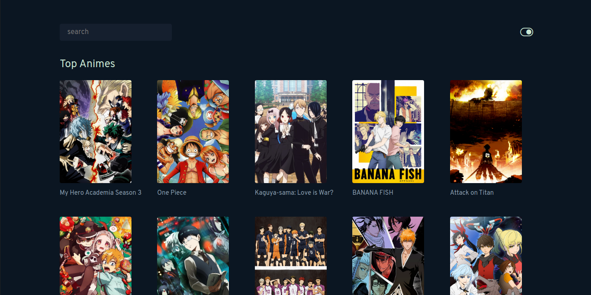
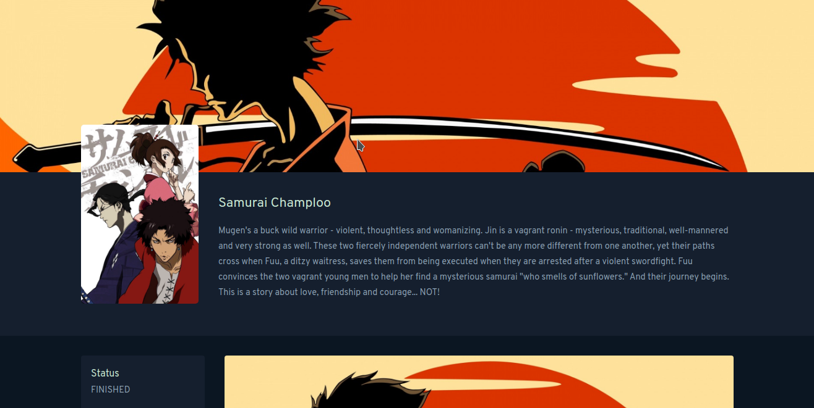
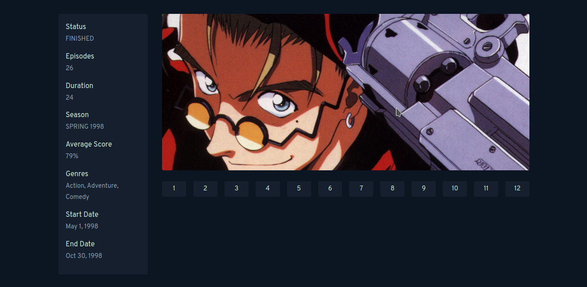
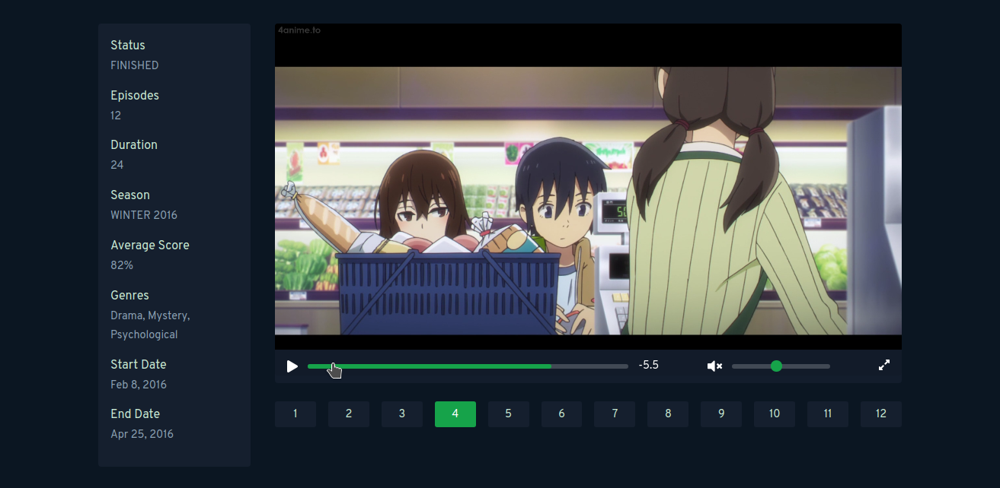

# AniX - Stream Animes

AniX uses scraped data to allow the users watch, download their favorite animes. The scraping part is managed by python scrapy framework. If you are interested in looking at the backend code, [click here](https://gitlab.com/manikandanraji/anix-backend).

## Features

1. Watch Animes
2. Download Animes
3. Dark/light theme

## TODO

1. Queue Videos
2. Create playlists

## Running Locally

- Make sure to setup the [backend](https://gitlab.com/manikandanraji/anix-backend) first

- Create a .env file at the root directory with the following contents:

```bash
# CF stands for cloud function
REACT_APP_CF_ENDPOINT=https://cloud-functions-qem9p2auy.vercel.app/api
REACT_APP_SCRAPER_ENDPOINT=https://localhost:5000/crawl.json
```

- Run <code>npm i && npm start</code> to start watching animes

## UI

### Home



### Anime Page



### Anime Page 2



### Video Player


